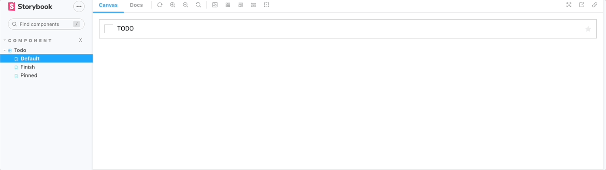

# 🕹️ To do list로 보는 Storybook의 UI 개발 및 Test Flow

```bash
yarn create react-app ./ --template typescript
npx sb init
```

<br />

# 🐼 Intro


Storybook에서 예시로 사용하는 Todolist App을 만들어보겠습니다.

<br />

# UI Spec


Todo UI의 기능 명세는 이렇습니다.

- `TodoData`
  - `title` : Todo의 내용
  - `state` : Todo의 완료 여부
- `pinned` : Todo 상단 고정 여부
- `onEditTitle` : Todo의 제목을 수정할 수 있다
- `onTogglePinTask` : 목록 중에서 상단으로 고정할 수 있다.
- `onArchiveTodo` : Todo를 완료시킬 수 있다.

그리고 `Todolist`는 이 `Todo`의 목록의 부모 컴포넌트입니다.

Todo에 들어갈 데이터 배열 상태를 여기서 관리할 예정입니다.

<br />

# 개발 프로세스

## 1. 디자인에 맞춰 컴포넌트 개발

```tsx
// component/todo/todo.stories.tsx
import React from "react";
import { ComponentStory, ComponentMeta } from "@storybook/react";
import Todo from ".";

export default {
  title: "component/Todo",
  component: Todo,
} as ComponentMeta<typeof Todo>;

const Template: ComponentStory<typeof Todo> = (args) => <Todo {...args} />;

export const Default = Template.bind({});
Default.args = {};
```

`Todo` 컴포넌트를 개발하기 위해 스토리 파일을 생성해줍니다.

react-app에서 매번 일일이 import하여 눈으로 확인하고 State를 체크할 것이 아니라

스토리북 환경에서 간편하게 UI를 개발할 수 있습니다.


첫 스토리를 작성했습니다! 이제 구현해야될 상태들을 작성해봅시다!

<br />

## 2. 테스트 케이스 작성



스토리북에서는 테스트 케이스를 스토리라고 합니다.

스토리는 컴포넌트의 특정 상태, 즉 브라우저에서 실제 렌더링된 상태를 포착합니다.

현재 `Todo` 컴포넌트에는 이렇게 총 세 가지 상태가 있습니다.

- 기본 상태
- 고정 되었을 때
- 완료하였을 때

이 각 상태에 대한 스토리를 추가해봅시다.

<br />

## 3. 검증하기

검증은 컴포넌트가 스토리북에서 어떻게 보이는지 개발자가 직접 평가하는 과정입니다.

즉, 디자인 명세와 일치하는지 확인하는 일입니다.

```tsx
// todo.stories.tsx
...

const mock: TodoData = {
	id: 0,
	title: "TODO",
	state: "NONE",
};

...

const longTextString =
	"Lorem, ipsum dolor sit amet consectetur adipisicing elit. Nulla libero accusamus magni harum optio eligendi, architecto iste vitae nesciunt officiis ea numquam possimus, debitis atque quidem corrupti, incidunt explicabo fugiat?";

export const LongText = Template.bind({});
LongText.args = {
	todo: {
		...mock,
		title: longTextString,
	},
};
```

스토리를 작성하다 보면 그 이전에는 미처 고려하지 못했던 시나리오도 떠오릅니다.

예를 들어 사용자가 정말 긴 내용의 Todo를 입력하면 어떻게 될까요?

이런 예외케이스 또한 스토리를 추가해 검증할 수 있습니다.


예상치 못하게 스타일이 깨진 것을 PR을 올리기 전에 확인했고 리뷰어 또한 눈으로 바로 확인가능합니다!

<br />

## 4. 동작 테스트

`Todo` 컴포넌트에서 클릭 이벤트를 활용할 부분은 총 3개입니다.

- 체크박스를 클릭했을 때
- 텍스트를 클릭했을 때
- 즐겨찾기(별) 버튼을 클릭했을 때

```tsx
const Todo = ({
  todo,
  pinned,
  onArchiveTodo,
  onEditTitle,
  onTogglePinTask,
}: TodoProps) => {
  return (
    <TodoWrapper>
      <TodoLeftBox>
        <TodoInput type="checkbox" checked={todo.checked} />

        <TodoCheckbox onClick={() => onArchiveTodo(todo.id)}>
          <FaCheck size={20} />
        </TodoCheckbox>

        <TodoContent onClick={() => onEditTitle(todo.title)}>
          {todo.title}
        </TodoContent>
      </TodoLeftBox>

      <FaStar
        onClick={() => onTogglePinTask(todo.id)}
        color={pinned ? "#FED049" : "#eee"}
      />
    </TodoWrapper>
  );
};
```

함수들은 위 부모 컴포넌트에서 주입해줄 것이기 때문에 여기서는 인자가 맞게 넘어갔는지

이벤트가 원하는 타겟에서 이뤄졌는지 확인할 예정입니다.


이제 Storybook의 `action` addon을 활용해보겠습니다. 함수들이 알맞게 호출되었고 인자 또한 확인되었습니다.

## 5. 자동으로 회귀 포착하기

일단 예상대로 만들어졌습니다. 하지만 앞으로도 `CSS`가 깨지지 않도록 하려면 어떻게 해야 될까요?

매번 수동으로 눈으로 확인하기보다 시각적 회귀 테스트 도구를 사용하여 회귀를 자동으로 확인하는 방법을 사용해보겟습니다.

스토리북에서 만든 `chromatic`을 사용해보겠습니다.

https://www.chromatic.com/docs/setup


이제 로그인 후 프로젝트를 생성합니다. 크로마틱은 스토리북용으로 특별히 제작되었으며 따로 구성이 없습니다.

아래 커맨드를 실행해 크로마틱이 각 스토리의 스냅샷을 캡처하게 해봅시다.

```bash
yarn add -D chromatic

npx chromatic --project-token=[Token]
```


한번 잘 작동하는지 확인해보겠습니다.

```tsx
<TodoCheckbox onClick={onArchiveTodo}>
  <FaCheck size={20} />
</TodoCheckbox>
```

아이콘의 사이즈를 아주 약간 수정하고 커밑하려고 합니다. 이제 크로마틱에서 어떤 식으로 보여주는지 확인해봅시다.


크로마틱 웹에서는 컴포넌트가 바뀌었다는 메세지가 왔습니다.


스토리들을 리뷰할 수 있는 UI가 나옵니다. 마치 깃허브의 PR처럼 팀으로도 사용가능하며

해당 리뷰어들의 Approve가 있어야만 Merge되도록 하는 것도 가능합니다.


저희가 수정한 파일이 비주얼적으로 어떻게 바뀌었으며 코드 또한 같이 올라옵니다.

## 6. Composition Test

    	컴포넌트 하나의 버그가 주변의 다른 부분에도 전부 영향을 미칩니다.
    	복합 컴포넌트는 단순한 컴포넌트 여러 개가 모여 구성되며 애플리케이션의 상태와도 연결됩니다.
    	모듈 하나의 결함이 심각한 오류로 확대될 수 있습니다.

이제 만들어진 Todo 컴포넌트들로 구성될 `TodoList` 컴포넌트를 개발하려 합니다.

```tsx
export const TodoList = ({
  list,
  onArchiveTodo,
  onEditTitle,
  onTogglePinTask,
}: TodoListProps) => {
  const events = {
    onArchiveTodo,
    onEditTitle,
    onTogglePinTask,
  };

  return (
    <div>
      {list
        .filter((todo) => todo.pinned)
        .map((todo) => {
          return <Todo todo={todo} {...events} />;
        })}

      {list
        .filter((todo) => !todo.pinned)
        .map((todo) => {
          return <Todo todo={todo} {...events} />;
        })}
    </div>
  );
};
```

```tsx
import { ComponentStory, ComponentMeta } from "@storybook/react";
import { TodoList } from ".";
import Todo from "../todo/todo.stories";

export default {
  title: "component/Todo List",
  component: TodoList,
  argTypes: {
    ...Todo.argTypes,
  },
} as ComponentMeta<typeof TodoList>;

const Template: ComponentStory<typeof TodoList> = (args) => (
  <TodoList {...args} />
);

export const Default = Template.bind({});
Default.args = {
  list: [
    { id: "1", checked: false, title: "Build a date picker" },
    { id: "2", checked: false, title: "QA dropdown" },
    {
      id: "3",
      checked: false,
      title: "Write a schema for account avatar component",
    },
    { id: "4", checked: false, title: "Export logo" },
    { id: "5", checked: false, title: "Fix bug in input error checked" },
    { id: "6", checked: false, title: "Draft monthly blog to customers" },
  ],
};
```

같은 props의 key와 타입이라면 다른 스토리의 argType을 복사할 수 있습니다.

이제 스토리에서 복합 컴포넌트의 동작이 잘 되는지 확인해봅시다.


## 7. 복합 컴포넌트 상태 Mocking

`TodoApp` 컴포넌트에서 fetch한 todo의 데이터리스트를 상태로 관리하고자 합니다. 

API 요청, 상태, 컨텍스트, 프로바이더 등 컴포넌트가 의존하는 모든 상황을 mocking할 수 있습니다.

여기서는 `Mock Service Worker` 애드온을 통해 네트워크 레벨에서 요청을 가로채 Mocking Response를 반환하게 해보겠습니다.

```bash
yarn add -D msw msw-storybook-addon
npx msw init public/ 
```

public 폴더에서 `mockServiceWorker.js` 파일이 생성되었으면 스토리북 환경에도 추가 세팅을 해줘야 합니다.

```js
// .storybook/preview.js
import { initialize, mswDecorator } from 'msw-storybook-addon';

initialize();

export const parameters = {
  actions: { argTypesRegex: '^on[A-Z].*' },
  controls: {
    matchers: {
      color: /(background|color)$/i,
      date: /Date$/,
    },
  },
};

export const decorators = [Story => <Story />, mswDecorator];
```

```tsx
// todo-app.stories.tsx
import {rest} from "msw";
...
export const TodoDefault = Template.bind({});
TodoDefault.parameters = {
  msw: {
    handlers: [
      rest.get('/todo', (req, res, ctx) => {
        return res(ctx.json(TodoListDefault.args));
      }),
    ],
  },
};
```

해당 컴포넌트에서 일어나는 fetching을 `msw`가 인터셉트하여 모의 데이터를 대신 제공해줍니다.


Mocking된 데이터가 들어온 것을 네트워크 탭과 콘솔에서 둘 다 확인할 수 있습니다!

## 8. 컴포넌트 인터렉션 테스트하기

    UI는 표면상으로 사용자들이 눈으로 보고 상호작용합니다. 또한 그 안을 보면 정보와 이벤트의 흐름이 잘 동작되도록 연결되어 있습니다.

`TodoApp`에서 사용자는 일정을 고정시키기 위해 별 아이콘을 클릭할 수 있습니다. 또는 checkbox를 클릭해 업무를 수행했다고 완료할 수도 있습니다.

사용자가 버튼을 눌러 상호작용을 하면 이러한 상태의 변화와 렌더링된 UI가 업데이트되는 것이 하나의 주기입니다. 

우리는 이러한 모든 상태에서 컴포넌트가 올바르게 보이고, 해당하는 인터렉션에 반응하는지도 보장해야합니다.

### Test Runner

상호작용 테스트는 모의 데이터를 제공하여 테스트 시나리오를 설정하고 Testing Library를 사용하여 인터렉션을 시뮬레이션하고 결과로 렌더링된 DOM을 확인하는 방식으로 진행됩니다.

```bash
yarn add -D @storybook/testing-library @storybook/jest @storybook/addon-interactions @storybook/test-runner
```

설치 후 스토리북 `main.js`도 수정해줍니다.

```js
// .storybook/main.js
module.exports = {
    ...,
    addons: [
      ...
              '@storybook/addon-interactions',
    ],
    features: {
      interactionsDebugger: true,
    },
    ...
}
```

package.json의 스크립트에도 스토리북의 테스트 실행 커맨드를 추가해주십시다.

```json
...
"script": {
  "test-storybook": "test-storybook"
}
...
```


