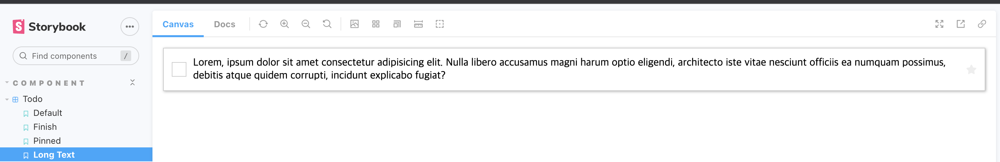

# 🕹️ To do list로 보는 Storybook의 UI 개발 및 Test Flow

```bash
yarn create react-app ./ --template typescript
npx sb init
```

<br />

# 🐼 Intro


Storybook에서 예시로 사용하는 Todolist App을 만들어보겠습니다.

<br />

# UI Spec


Todo UI의 기능 명세는 이렇습니다.

- `TodoData`
  - `title` : Todo의 내용
  - `state` : Todo의 완료 여부
- `pinned` : Todo 상단 고정 여부
- `onEditTitle` : Todo의 제목을 수정할 수 있다
- `onTogglePinTask` : 목록 중에서 상단으로 고정할 수 있다.
- `onArchiveTodo` : Todo를 완료시킬 수 있다.

그리고 `Todolist`는 이 `Todo`의 목록의 부모 컴포넌트입니다.

Todo에 들어갈 데이터 배열 상태를 여기서 관리할 예정입니다.

<br />

# 개발 프로세스

## 1. UI Story 파일 생성


```tsx
import React from "react";
import { ComponentStory, ComponentMeta } from "@storybook/react";
import Todo from ".";

export default {
  title: "component/Todo",
  component: Todo,
} as ComponentMeta<typeof Todo>;

const Template: ComponentStory<typeof Todo> = (args) => <Todo {...args} />;

export const Default = Template.bind({});
Default.args = {};
```

리액트 서버를 키거나 할 것 없이 스토리북 환경에서 바로 눈으로 확인하며 개발합니다.

<br />

## 2. 컴포넌트 개발 후 테스트 케이스 작성


스토리북에서는 테스트 케이스를 스토리라고 합니다.

스토리는 컴포넌트의 특정 상태, 즉 브라우저에서 실제 렌더링된 상태를 포착합니다.

현재 `Todo` 컴포넌트에는 이렇게 총 세 가지 상태가 있습니다.

- 기본 상태
- 고정 되었을 때
- 완료하였을 때

이 각 상태에 대한 스토리를 추가해봅시다.

<br />

## 3. 검증하기

검증은 컴포넌트가 스토리북에서 어떻게 보이는지 개발자가 직접 평가하는 과정입니다.

즉, 디자인 명세와 일치하는지 확인하는 일입니다.

```tsx
// todo.stories.tsx
...

const mock: TodoData = {
	id: 0,
	title: "TODO",
	state: "NONE",
};

...

const longTextString =
	"Lorem, ipsum dolor sit amet consectetur adipisicing elit. Nulla libero accusamus magni harum optio eligendi, architecto iste vitae nesciunt officiis ea numquam possimus, debitis atque quidem corrupti, incidunt explicabo fugiat?";

export const LongText = Template.bind({});
LongText.args = {
	todo: {
		...mock,
		title: longTextString,
	},
};
```

스토리를 작성하다 보면 그 이전에는 미처 고려하지 못했던 시나리오도 떠오릅니다.

예를 들어 사용자가 정말 긴 내용의 Todo를 입력하면 어떻게 될까요?

이런 예외케이스 또한 스토리를 추가해 검증할 수 있습니다.



예상치 못하게 스타일이 깨진 것을 PR을 올리기 전에 확인했고 리뷰어 또한 눈으로 바로 확인가능합니다!
